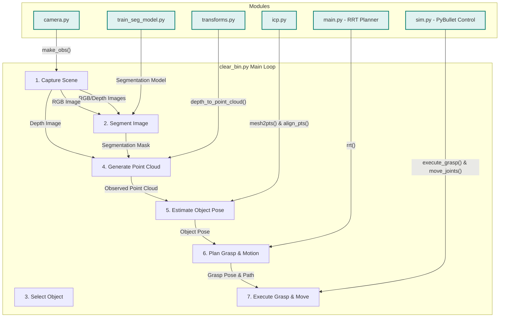

# Project Analysis: graspGripper

## 1. High-Level Project Overview

The `graspGripper` project implements a complete "pick-and-place" robotics pipeline within a simulated environment. The primary objective is to autonomously identify, locate, and grasp multiple objects from a bin and transfer them to a target location until the bin is clear.

This is achieved by integrating several key robotics and computer vision modules:

*   **Simulation:** A PyBullet-based environment with a UR5 robot, a gripper, two totes, and various objects.
*   **Perception:** A virtual camera captures RGB and depth data from the scene.
*   **Segmentation:** A U-Net-based deep learning model processes the RGB image to identify which pixels belong to which object.
*   **Pose Estimation:** The Iterative Closest Point (ICP) algorithm refines the 3D position and orientation of a target object.
*   **Motion Planning:** The Rapidly-exploring Random Tree (RRT) algorithm plans a collision-free trajectory for the robot arm.
*   **Control:** Low-level functions execute the planned motions and gripper actions in the simulator.

The main script, `clear_bin.py`, serves as the central orchestrator, executing a "sense-plan-act" loop that ties all these modules together.

## 2. Core Script Analysis & Relationships

Here is a breakdown of each script and its role in the project.

### `clear_bin.py` (The Orchestrator)

*   **Purpose**: This is the main executable script. It initializes the entire system and runs the primary loop that drives the robot's behavior.
*   **Workflow**:
    1.  **Initialization**: Sets up the PyBullet simulation (`sim.py`), the camera (`camera.py`), and loads the pre-trained segmentation model (`train_seg_model.py`).
    2.  **Main Loop**: Continuously runs until all objects have been successfully grasped and moved.
    3.  **Sense (Perception)**: Captures an image (`camera.py`) and uses the neural network to generate a segmentation mask, identifying all objects in the scene.
    4.  **Select & Locate (Pose Estimation)**:
        *   Randomly selects a target object that has not yet been grasped.
        *   Isolates the object's point cloud using the segmentation mask and depth image (`icp.py`, `transforms.py`).
        *   Uses the Iterative Closest Point (ICP) algorithm (`icp.py`) to align a known mesh of the object with the observed point cloud, determining the object's precise 3D pose (position and orientation) in the world.
    5.  **Plan (Grasp & Motion)**:
        *   Calculates the required gripper pose to grasp the object based on the estimated pose and a pre-defined grasp transform.
        *   Uses the RRT algorithm (`main.py`) to plan a collision-free path to move the grasped object to the target tote.
    6.  **Act (Execution)**: Commands the simulated robot to execute the grasp and the planned path (`sim.py`).

### `sim.py` (The Simulation World)

*   **Purpose**: The interface to the PyBullet physics simulator. It is responsible for creating the environment, loading the robot and objects (from URDF files), and providing low-level control functions.
*   **Key Functions used by other scripts**:
    *   `PyBulletSim()`: Constructor that sets up the simulation, including the workspace, totes, and objects.
    *   `load_gripper()`: Attaches the gripper to the robot's end-effector.
    *   `execute_grasp()`: A high-level function that performs a multi-step grasp sequence (e.g., move above, descend, close gripper, lift).
    *   `move_joints()`: Moves the robot to a target joint configuration.
    *   `move_tool()`: Moves the end-effector to a target pose using inverse kinematics.
    *   `open_gripper()` / `close_gripper()`: Controls the end-effector.
    *   `check_collision()`: Checks if a given robot configuration is in collision with obstacles.

### `camera.py` (The Robot's Eyes)

*   **Purpose**: Manages the virtual camera within the simulation. It defines camera properties (intrinsics, resolution) and handles rendering images.
*   **Key Functions used by other scripts**:
    *   `Camera()`: Constructor to define camera parameters.
    *   `make_obs()`: Captures RGB, depth, and segmentation images from the current simulation view.
    *   `cam_view2pose()`: Converts PyBullet's view matrix into a standard 4x4 pose matrix, essential for coordinate transformations.

### `train_seg_model.py` (The Brains of Perception)

*   **Purpose**: Contains everything related to the image segmentation model. It defines the `miniUNet` architecture, handles data loading with `RGBDataset`, and provides functions to train the model and load its weights from a checkpoint.
*   **Key Components used by `clear_bin.py`**:
    *   `miniUNet()`: The U-Net-based neural network model class.
    *   `load_chkpt()`: A utility function to load the saved weights into an instantiated model.
    *   `RGBDataset`: A PyTorch `Dataset` class used to preprocess the input image before feeding it to the model.

### `icp.py` (The Pose Estimator)

*   **Purpose**: Implements the Iterative Closest Point (ICP) algorithm. ICP is crucial for refining an object's pose by aligning a known model point cloud with an observed point cloud from the scene.
*   **Key Functions used by `clear_bin.py`**:
    *   `gen_obj_depth()`: Isolates the depth values of a specific object using the predicted segmentation mask.
    *   `mesh2pts()`: Samples points from a 3D mesh file (`.obj`) to create the "ground truth" point cloud for alignment.
    *   `align_pts()`: The core ICP function that takes two point clouds and computes the rigid transformation that best aligns them.

### `transforms.py` (The Geometric Calculator)

*   **Purpose**: Provides essential utility functions for 3D geometric transformations. It is the mathematical backbone for converting between different reference frames (camera, world) and data types (depth image, point cloud).
*   **Key Functions used by `clear_bin.py`**:
    *   `depth_to_point_cloud()`: Converts a depth image into a 3D point cloud using the camera's intrinsic matrix.
    *   `transform_point3s()`: Applies a 4x4 transformation matrix to a set of 3D points.

### `main.py` (The Path Planner)

*   **Purpose**: Contains the motion planning algorithm. It implements the Rapidly-exploring Random Tree (RRT) algorithm to find a collision-free sequence of joint configurations to move the robot's arm from a start to a goal position.
*   **Key Functions used by `clear_bin.py`**:
    *   `rrt()`: The main planning function that searches for a valid path, calling `env.check_collision()` at each step.

## 3. Workflow Diagram

This diagram illustrates how the modules collaborate in the main loop of `clear_bin.py`.

## 4. Summary

This project is a well-structured example of a modern robotics system, demonstrating a clear separation of concerns. Each module has a distinct and logical responsibility, which makes the overall system easier to understand, debug, and extend.